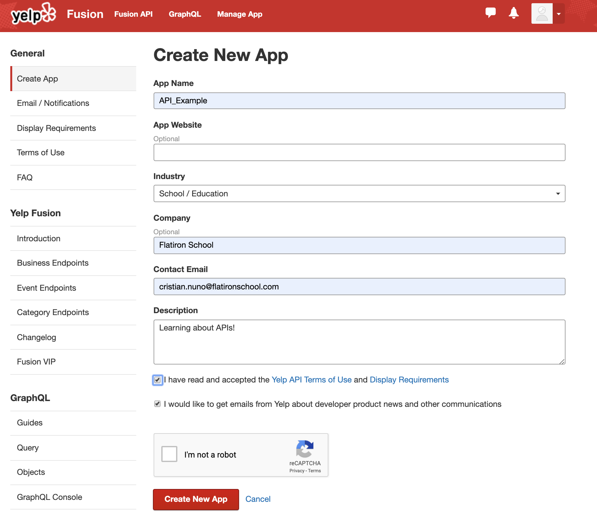

# Using the Yelp API - Codealong

The previously deployed Codealong around working with the twitter API can be found [here](https://github.com/learn-co-curriculum/dsc-2-15-08-Twitter-API-tokens-codealong/tree/d297ab4dee806203cb861ce4f39b301c5189990f) (not relevant for new students).


## Introduction

Now that we've discussed HTTP requests and OAuth, it's time to practice applying those skills to a production level API. In this codealong, we'll take you through the process of signing up for an OAuth token and then using that to make requests to the Yelp API!

## Objectives

You will be able to:

* Generate an OAuth token for the yelp API
* Make requests using OAuth

## Generating Access Tokens

As discussed, in order to use many APIs, one needs to use OAuth which requires an access token. As such, our first step will be to generate this login information so that we can start making some requests.  

With that, lets go grab an access token from an API site and make some API calls!
Point your browser over to this [yelp page](https://www.yelp.com/developers/v3/manage_app) and start creating an app in order to obtain and api access token:




You can either sign in to an existing Yelp account, or create a new one, if needed.

On the page you see above, simply fill out some sample information such as "Flatiron Edu API Example" for the app name, or whatever floats your boat. Afterwards, you should be presented with an API key that you can use to make requests!

With that, it's time to start making some api calls!

### Should I publicly share my passwords on Github?

When using an api that reqires an api key and password you should NEVER hardcode theses values into your main file. When you upload your project onto github it is completely public and vulnerable to attack. Assume that if you put sensitive information publicly on the internet it will be found and abused. 

To this end, how can we easily access our api key without opening ourselves up to vulnerabilities?

There are many ways to store sensitive information but we will go with this method. 

#### Move to your home (root) directory:

```
cd ~
```

#### Now make the `.secret/` directory:

```
mkdir .secret
```

This will create a new folder in your home directory where you can store files for any of the api information you have. 

Can you find the file you just made in your terminal? 
NOTE: dot files won't show up with just `ls` you must use the show all command as well `ls -a`


#### Move into the newly created `.secret/` folder and create a file using vscode or any text editor to store your yelp api login info.

```
cd .secret/
code yelp_api.json
```

In this file, lets create a dictionary of values representing the client id and api key that looks something like this:

`{"client_id": "input client id here!", "api_key": "input api key here!"}`

NOTE: Double quotes are important! You'll copy and paste the `client_id` and `api_key` values that yelp grants you after you create your app.

Ok, so now we have a file in our .secret folder on our home directory. Safe and sound (mostly) from anyone trying to steal our info off github.

#### Finally, lets get our client id and api key into our jupyter notebook.

If we remember that our file is just a regular json file, open the file and pull out the appropriate information from the `~/.secret/yelp_api.json` file. 


```python
import json

def get_keys(path):
    with open(path) as f:
        return json.load(f)

# NOTE: please change the file path to be your root directory; not Cristian's :) 
keys = get_keys("/Users/cnuno/.secret/yelp_api.json")

client_id = keys['client_id']
api_key = keys['api_key']
```

## An Example Request with OAuth <a id="oauth_request"></a>
https://www.yelp.com/developers/documentation/v3/get_started

In the next lesson, we'll further dissect how to read and translate online documentation like the link here. For now, let's simply look at an example request and dissect it into its consituent parts:


```python
import requests

term = 'Mexican'
location = 'Astoria NY'
SEARCH_LIMIT = 10

url = 'https://api.yelp.com/v3/businesses/search'

headers = {
        'Authorization': 'Bearer {}'.format(api_key),
    }

url_params = {
                'term': term.replace(' ', '+'),
                'location': location.replace(' ', '+'),
                'limit': SEARCH_LIMIT
            }
response = requests.get(url, headers=headers, params=url_params)
print(response)
print(type(response.text))
print(response.text[:1000])
```

## Breaking Down the Request

As you can see, there are three main parts to our request.  
  
They are:
* The url
* The header
* The parameters
  
The url is fairly straightforward and is simply the base url as described in the documentation (again more details in the upcoming lesson).

The header is a dictionary of key-value pairs. In this case, we are using a fairly standard header used by many APIs. It has a strict form where 'Authorization' is the key and 'Bearer YourApiKey' is the value.

The parameters are the filters which we wish to pass into the query. These will be embedded into the url when the request is made to the api. Similar to the header, they form key-value pairs. Valid key parameters by which to structure your queries, are described in the API documentation which we'll look at further shortly. A final important note however, is the need to replace spaces with "+". This is standard to many requests as URLs cannot contain spaces. (Note that the header itself isn't directly embedded into the url itself and as such, the space between 'Bearer' and YourApiKey is valid.)


## The Response

As before, our response object has both a status code, as well as the data itself. With that, let's start with a little data exploration!


```python
response.json().keys()
```

Now let's go a bit further and start to preview what's stored in each of the values for these keys.


```python
for key in response.json().keys():
    print(key)
    value = response.json()[key] #Use standard dictionary formatting
    print(type(value)) #What type is it?
    print('\n\n') #Seperate out data
```

Let's continue to preview these further to get a little better acquainted.


```python
response.json()['businesses'][:2]
```


```python
response.json()['total']
```


```python
response.json()['region']
```

As you can see, we're primarily interested in the 'bussinesses' entry. 

Let's go ahead and create a dataframe from that.


```python
import pandas as pd

df = pd.DataFrame.from_dict(response.json()['businesses'])
print(len(df)) #Print how many rows
print(df.columns) #Print column names
df.head() #Previews the first five rows. 
#You could also write df.head(10) to preview 10 rows or df.tail() to see the bottom
```

## Summary <a id="sum"></a>

Congratulations! We've covered a lot here! We took some of your previous knowledge with HTTP requests and OAuth in order to leverage an enterprise API! Then we made some requests to retrieve information that came back as a json format. We then transformed this data into a dataframe using the Pandas package. In the next lab, we'll break down how to read API documentation and then put it all together to make a nifty map!
